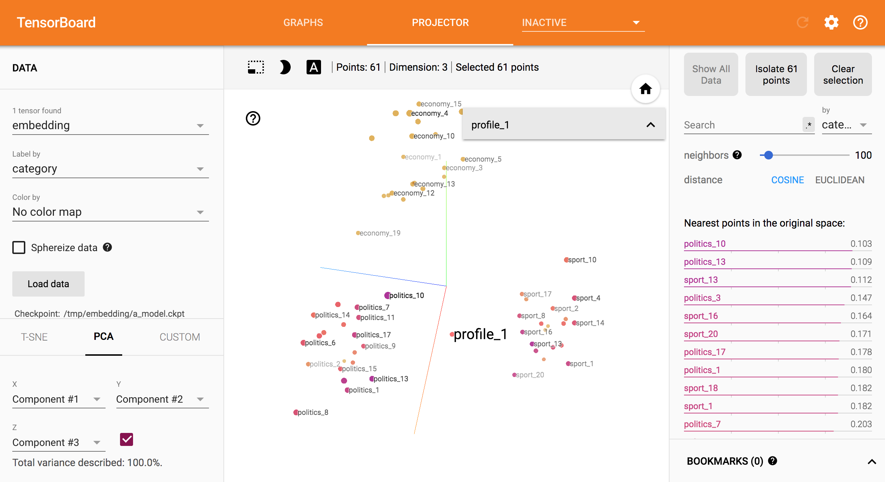

# Embedding Visualization in TensorBoard

Embeddings are used in many different machine learning use cased, they appearing in recommender systems, NLP, and many other applications.
TensorBoard has a [built-in visualizer](https://www.tensorflow.org/programmers_guide/embedding), called the *Embedding Projector*, for 
interactive visualization and analysis of high-dimensional data like embeddings. The embedding projector will read the embeddings from 
a model checkpoint file. 

If you do not have a model checkpoint file and just want to visualize embedding data in TensorBoard the API is quite cumbersome to use. This
example generates fake embedding data and creates the necessary files for visualization in TensorBoard.

Generate embeddings:

	python embedding.py --output-dir /tmp/my_embedding

Start Tensorboard:

	python embedding.py --output-dir /tmp/my_embedding

Open a Browser at http://127.0.0.1:6006 and go to the Projector tab

